由于工作需要，很多时候我们可能需要用科学上网的方式去查资料。科学上网的途径主要有以下几种：

* 购买VPN

* 免费的VPN

* 搭建vps服务器

  三种方式各有各的优缺点，主要还是看你怎么选择咯~

  通过vpn上网的优点就是操作简单，比较适合不是经常使用科学上网的人，但是也有缺点。缺点就是容易被封，会被限制速度。

  PS：免费VPN与付费VPN的主要区别在于安全性，也就是说免费的可能会泄露的个人信息。但是！试问谁在网上不是裸奔呢？

  这里我主要讲第三种方式——搭建VPS服务器

# 购买服务器

  这里推荐几个个国外的VPS服务器厂商

  * [Vultr](https://www.vultr.com/?ref=7234693)

  * [Bandwagonhost(搬瓦工)](https://bwh8.net/)

	这两个算是比较不错的vps服务器厂商，因为我购买的时候搬瓦工已经没有了19.9刀一年的服务器了，所以我选择了[Vultr](https://www.vultr.com/?ref=7234693)，支持支付宝和微信付款，还是比较方便的。 

## 注册账号

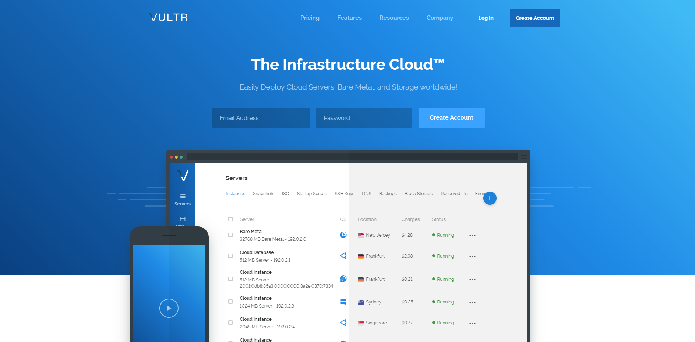

填写你的e-mail地址和密码，然后创建一个账号，可能会需要你验证邮箱什么的，跟着操作就好咯，这里就不赘述了。

## 激活账号

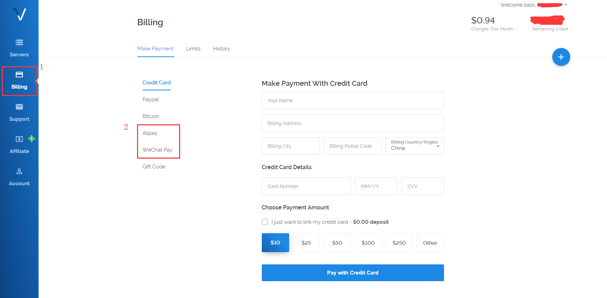

登陆进去后点击左边菜单栏的Billing 选择 Alipay(支付宝)或者 WeChat Pay(微信)付款10刀才能激活账户，差不多够用两个多月左右(3.5刀/月)，激活完成后点击右上角的进行服务器的购买

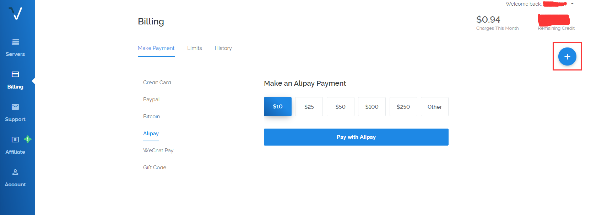

## 服务器选择

主要分为3步：选择服务器位置，选择系统，选择配置

### 选择服务器位置

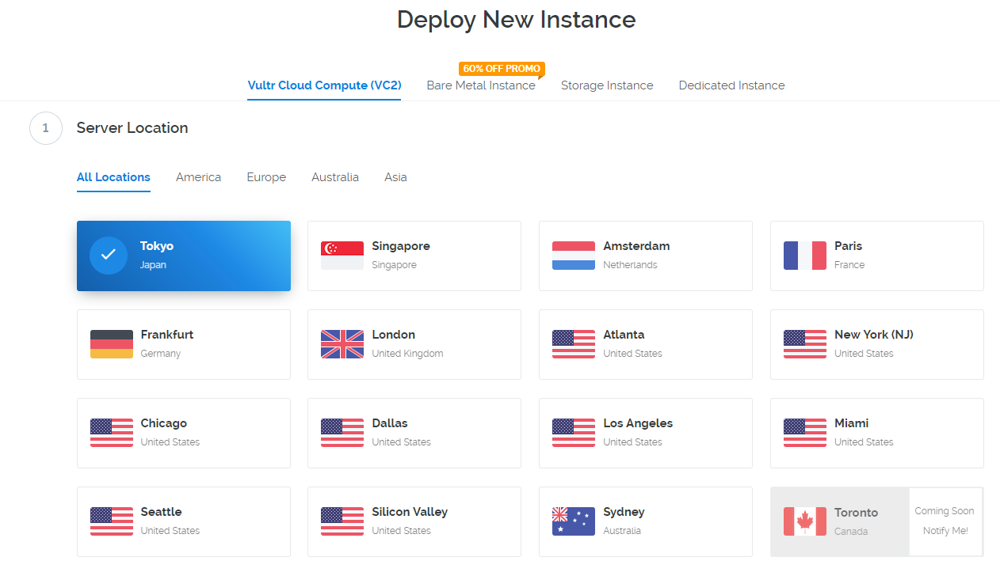

> 理论上：离你越近越好，通常选择tokyo节点

### 选择系统

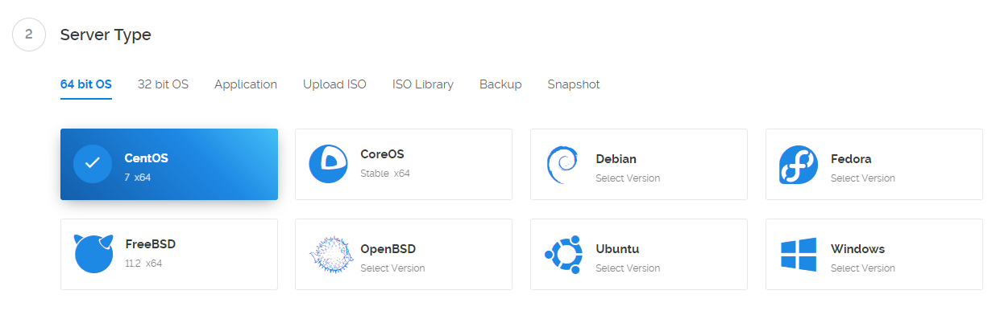

> 推荐选择 CentOs7

### 选择配置

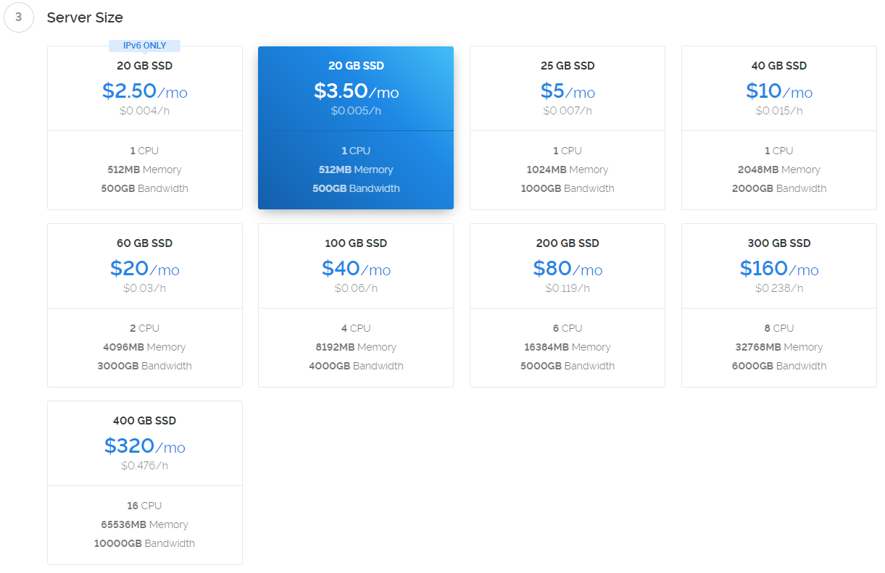

> 由于2.5刀的配置只有ipv6，我们这里选择3.5刀的配置，这两个配置的区别就是一个没有ipv4一个有ipv4，由于ipv6不稳定，建议选择3.5刀的配置。

### 提交

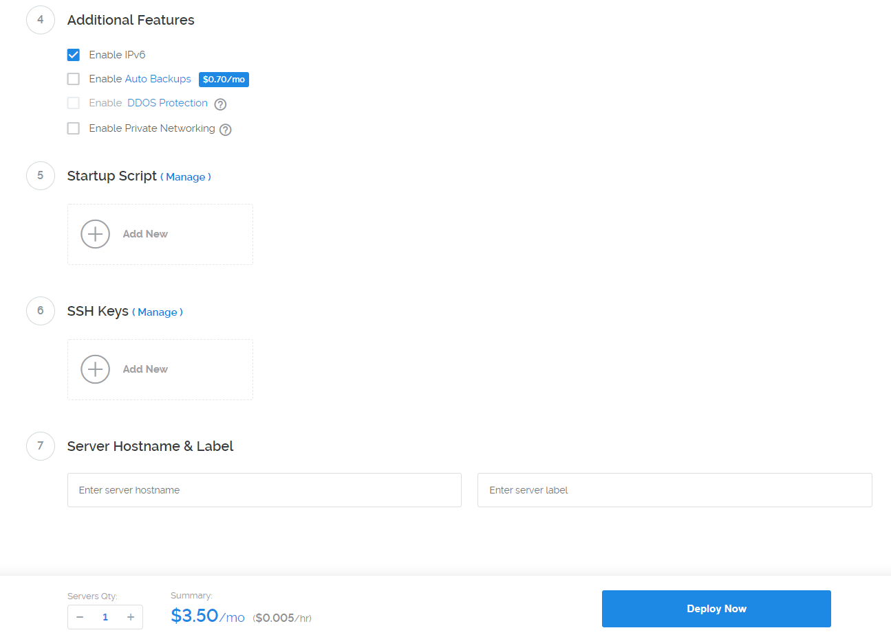

> 选择好了之后，我们点击下面的 Deploy Now 就OK啦~

至此，服务器就已经购买完成啦，我们回到控制台界面。

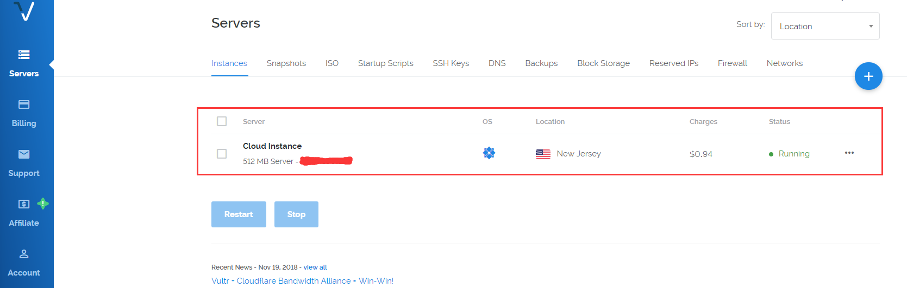

这里就是你购买的服务器啦，下面我们开始搭建VPS

# 搭建VPS

点击你的服务器，进入服务器详细页面

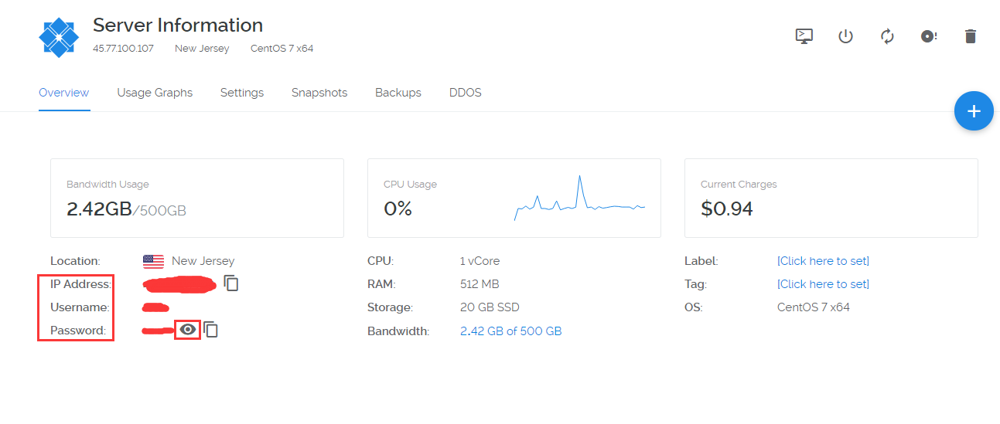

> IP Address:你的IP地址
>
> Username：用户名
>
> Password：密码
>
> 小眼睛：查看密码

## 登陆服务器

我们在电脑上(win10)呼出cmd（win+r => 输入cmd => 回车）

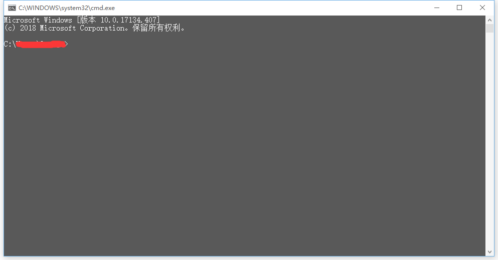

打开就是这样的，下面我们通过ssh登入服务器

``` bash
ssh 用户名@ip地址
```

> 用户名和ip地址需要你自己填写

输入完成后需要输入密码

> 密码不会显示出

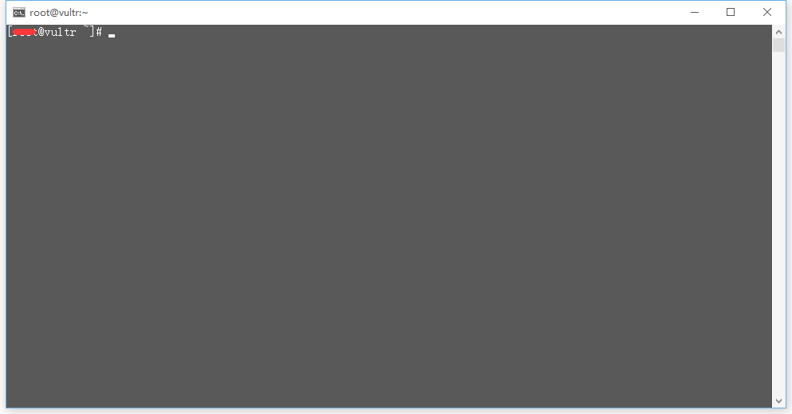

这样表示已经登录成功了。

## Shadowsocks版
### 安装Shadowsocks服务端

在服务器上依次执行

```bash
wget --no-check-certificate -O shadowsocks-all.sh https://raw.githubusercontent.com/teddysun/shadowsocks_install/master/shadowsocks-all.sh

sh shadowsocks-all.sh
```

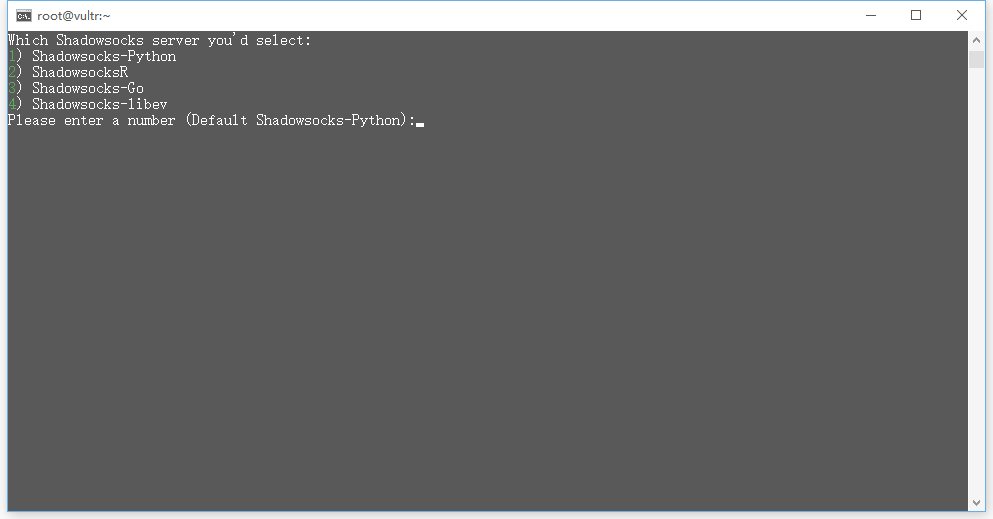

> 选择你要安装的Shadowsocks版本，默认Python版

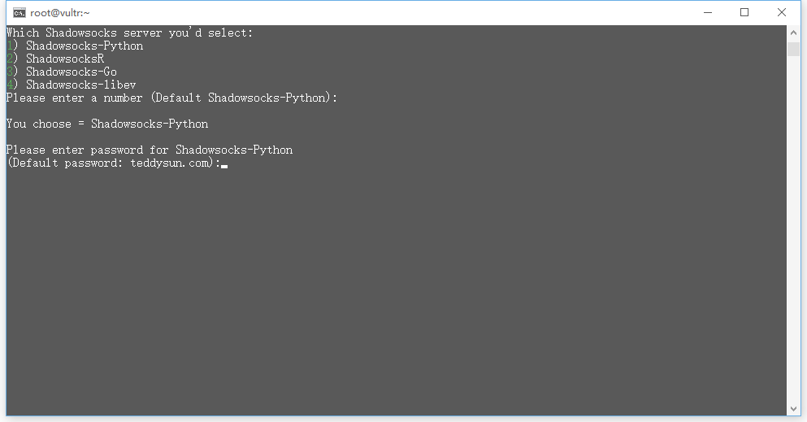

> 输入你的ShadowSocks密码，默认 teddysun.com

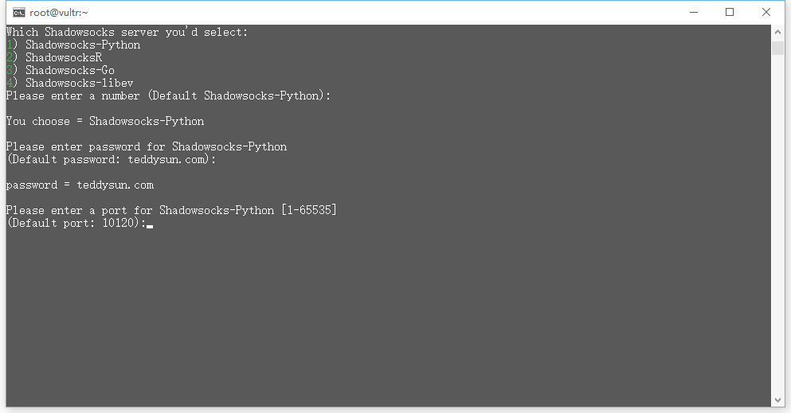

> 选择你的端口，默认10120端口

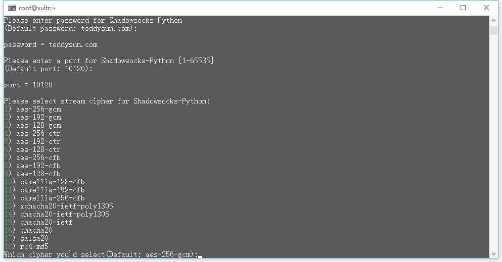

> 选择你的混淆方式，默认aes-256-gcm，这里建议选择aes-256-cfb的方式，只需要输入对应的序号即可

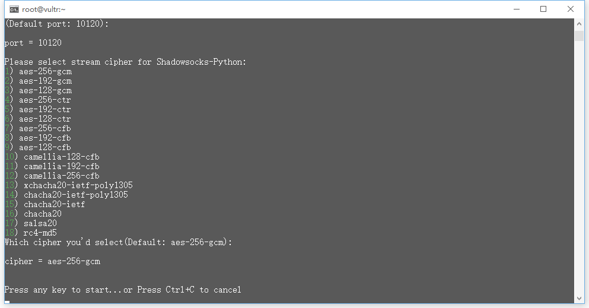

> 全部选择完成后，再按下回车就开始安装了。

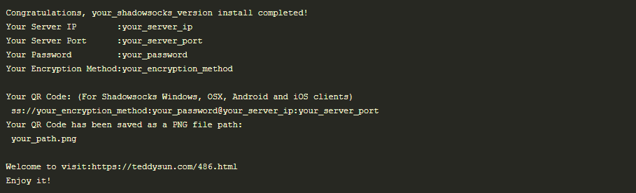

> 安装完成后，脚本提示安装成功。

至此，我们的ShadowSocks的服务端就安装完毕了。下面我们安装客户端，安装好客户端后，我们就能使用啦！

### 安装ShadowSocks客户端

常规版 Windows 客户端
<https://github.com/shadowsocks/shadowsocks-windows/releases>

ShadowsocksR 版 Windows 客户端
https://github.com/shadowsocksrr/shadowsocksr-csharp/releases

客户端安装好之后，我们来对客户端进行配置

打开你下载的客户端，在你的控制栏找到一个小飞机的图标，然后单击鼠标右键=>服务器=>编辑服务器=>添加

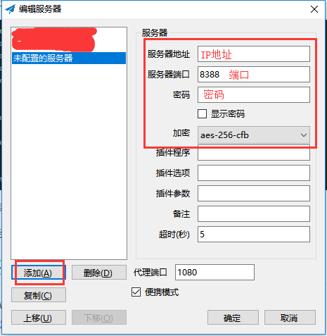

依次输入你的ip地址，端口，密码以及加密方式，然后点击确定

最后，我们再将【启用系统代理】和【系统代理模式/全局模式】勾选上，就大功告成啦！

## v2ray版(19-12-2更新)

### 安装v2ray服务端

在服务器上依次执行

``` bash
yum install curl vim -y
bash <(curl -L -s https://install.direct/go.sh)
```

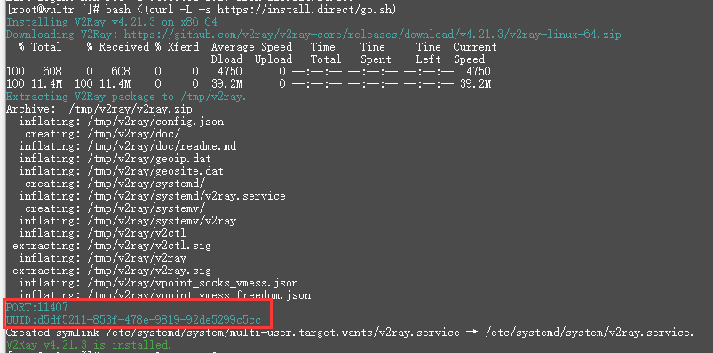

> 当出现上图的界面时，表示安装成功，此时需要复制出图中红框标注的信息备用。

此时我们仅安装好了v2ray，但并未启动，接下来我们来启动v2ray。

依次执行命令

``` bash
systemctl start v2ray
systemctl status v2ray
```

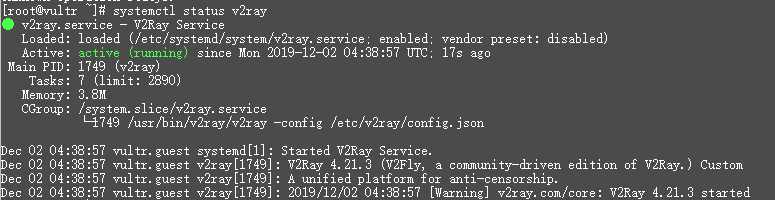

> 出现上图界面时，表示v2ray已成功启动了。

接下来我们就需要关闭防火墙了

> *如果你的服务器上有重要资料，那么请不要关闭防火墙，建议你百度一下【你的系统+防火墙开放端口】（例如搜索：CentOS 7 防火墙开放端口）来学习如何放行端口，只要放行刚刚安装完成提示的端口即可，命令也简单，但是不同的系统不一定一样，这里就不展开了。*

执行以下命令（3组只需要执行一组即可，如果报错就换一组执行）

``` bash
systemctl stop firewalld
systemctl disable firewalld
 
servcie iptables stop
chkconfig iptables off
 
ufw disable
```

至此，我们v2ray的服务端就安装完成啦，接下来是客户端的安装与配置。

###  安装v2ray客户端

我这里整理了一些不同平台的客户端

* v2rayW（Windows）： [Github](https://github.com/Cenmrev/V2RayW/releases)
* V2RayN（Windows）： [Github](https://github.com/2dust/v2rayN/releases)
* v2rayX（macOS）： [Github](https://github.com/Cenmrev/V2RayX/releases)
* V2RayU（macOS）： [Github](https://github.com/yanue/V2rayU/releases)
* Shadowrocket（iOS）： [itunes](https://itunes.apple.com/us/app/shadowrocket/id932747118?mt=8)
* i2Ray（iOS）： [itunes](https://itunes.apple.com/us/app/i2ray/id1445270056?mt=8)
* Quantumult（iOS）： [itunes](https://itunes.apple.com/us/app/quantumult/id1252015438?mt=8)
* BifrostV（Android）： [Play商店](https://play.google.com/store/apps/details?id=com.github.dawndiy.bifrostv) | [ApkPure](https://apkpure.com/bifrostv/com.github.dawndiy.bifrostv)
* V2RayNG（Android）： [Play商店](https://play.google.com/store/apps/details?id=com.v2ray.ang) | [Github](https://github.com/2dust/v2rayNG/releases)

由于版本众多，我就不一一展示了，这里就用windows的客户端v2rayN展示一下就好了，其实配置都是大同小异的。

在github上面下载完成后解压

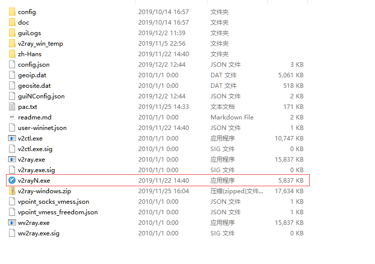

> 文件目录大致是这样，双击运行红框的.exe文件


> 启动成功后，在任务栏会有这样一个图标，双击图标显示软件主界面


> 点击服务器->添加[vmess]服务器


> 依次输入：服务器IP、端口、用户ID、额外ID、加密方式、传输协议等信息。

**端口：安装完成时让你保存的PORT的值**

**用户ID：安装完成时让你保存的UUID的值**

**额外ID、加密方式和传输协议按照图片中填写即可**


配置完成后，回车启用就可以开始网上重浪了。

# 安装BBR

BBR 是 Google 提出的一种新型拥塞控制算法，可以使 Linux 服务器显著地提高吞吐量和减少 TCP 连接的延迟。

BBR解决了两个问题：

* 再有一定丢包率的网络链路上充分利用带宽。非常适合高延迟，高带宽的网络链路。

* 降低网络链路上的buffer占用率，从而降低延迟。非常适合慢速接入网络的用户。

下面让我们开始安装吧！

安装之前我们需要先检查一下我们服务器的内核版本：

```bash
uname -r
```

如果得到的结果是3.xx.x什么的话，那我们需要先升级下内核到4.10版本以上

## 升级内核

依次输入：

```bash
sudo rpm --import https://www.elrepo.org/RPM-GPG-KEY-elrepo.org
sudo rpm -Uvh http://www.elrepo.org/elrepo-release-7.0-2.el7.elrepo.noarch.rpm
sudo yum --enablerepo=elrepo-kernel install kernel-ml -y
```

然后再检查下内核版本：

```bash
rpm -qa | grep kernel
```

如果输出结果显示 kernel-ml-4.19.xxxx 类似的内容说明安装成功

## 修改grub2引导

输入：

``` bash
sudo egrep ^menuentry /etc/grub2.cfg | cut -f 2 -d \'
```

输出：

``` bash
CentOS Linux 7 Rescue 3432d83bf4954c0d8cafec87176dfc15 (4.19.8-1.el7.elrepo.x86_64)
CentOS Linux (4.19.8-1.el7.elrepo.x86_64) 7 (Core)
CentOS Linux (3.10.0-957.1.3.el7.x86_64) 7 (Core)
CentOS Linux (3.10.0-957.el7.x86_64) 7 (Core)
CentOS Linux (0-rescue-84d6e1c3c43d427ab345edad898ac223) 7 (Core)
```

选择我们需要的内核 也就是 4.19.xxxx的那个

输入：

```bash
sudo grub2-set-default 1
reboot
```

**注意：**这里的 1 代表的是上面输出的第二排，以此类推。第一排代表0

重启：

``` bash
reboot
```

重启完成后，重新登录并重新运行命令来确认你是否使用了正确的内核：

``` bsah
uname -r
```

如果得到 【4.19.8-1.el7.elrepo.x86_64 】之类的，则说明升级成功

## 开启BBR

输入：

``` bash
echo 'net.core.default_qdisc=fq' | sudo tee -a /etc/sysctl.conf
echo 'net.ipv4.tcp_congestion_control=bbr' | sudo tee -a /etc/sysctl.conf
sudo sysctl -p
```

执行完成后我们来检查一下是否执行成功，输入：

``` bash
sudo sysctl net.ipv4.tcp_available_congestion_control
# 输出应为 net.ipv4.tcp_available_congestion_control = bbr cubic reno
sudo sysctl -n net.ipv4.tcp_congestion_control
# 输出应为 bbr
lsmod | grep bbr
# 输出应类似 tcp_bbr  16384  28
```

至此，我们的所有配置已经完成了，现在可以surf the Internet 啦！