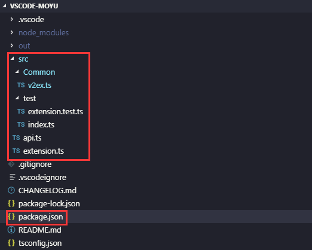
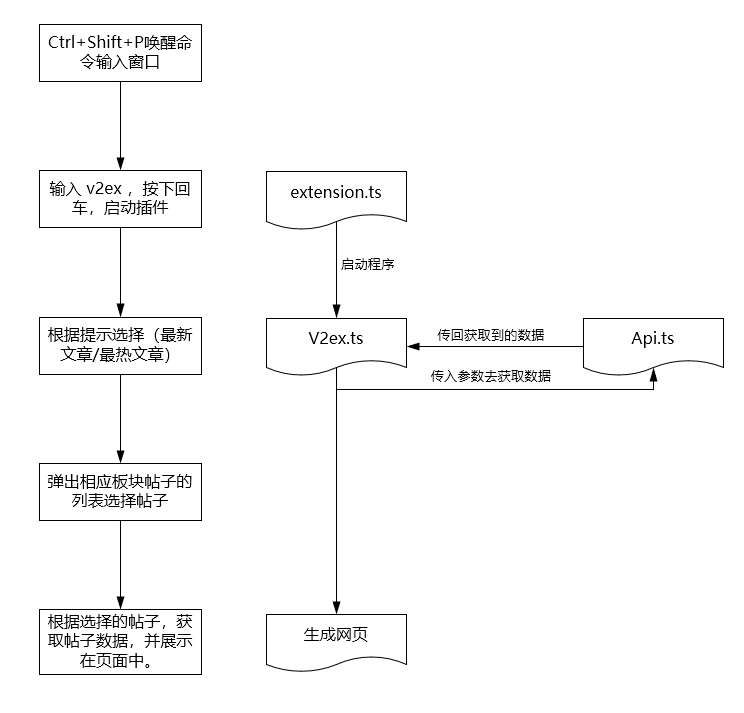
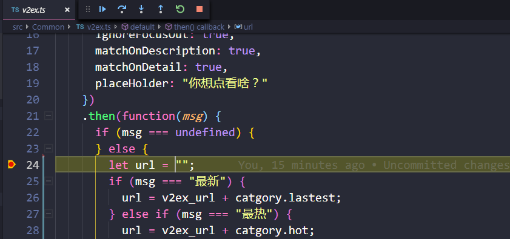

# 写在前面

项目的源码我已传至[GitHub](https://github.com/OrangeEd1t/VSCode-MOYU)欢迎clone。该项目是一个比较简单，适合新手入门的一个项目，项目结构简单不复杂。

## 项目结构

与上篇文章的目录结构大致类似



我们仅需要关注红框标识部分

```
* package.json[文件]:该文件在上篇文章中已提到，此处不再赘述。
* src[文件夹]:我们整个项目的存放目录。
* Common[文件夹]:这里存放的是我们程序实现的主体。
* test[文件夹]:这个文件夹里主要存放的测试需要的文件，可以不用去管它。
* api.ts[文件]:这里存放的是获取数据的程序。
* extension.ts[文件]:该文件在上篇文章中已提到，此处不再赘述。
```

## 项目执行流程



## 项目调试

vscode插件的调试非常简单方便，只需要在需要调试的地方打个断点，然后按`F5`执行即可：



## 项目发布

vsCode的插件发布也是非常的建单的，主要有3种方法：

* 直接把文件夹发给别人，别人找到vscode的插件存放目录并放进去，然后重启vscode。（不推荐）
* 方法二：打包成vsix插件，然后发送给别人安装，如果你的插件涉及机密不方便发布到应用市场，可以尝试采用这种方式；
* 方法三：注册开发者账号，发布到官网应用市场，这个发布和npm一样是不需要审核的。（推荐）

采用什么方式发布，可以根据自己的需要来决定。

具体参考该[文章](https://www.cnblogs.com/liuxianan/p/vscode-plugin-publish.html)

